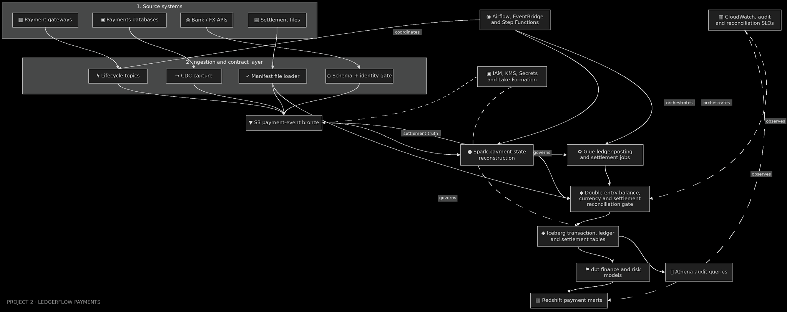

# LedgerFlow Payment Reconciliation Platform

[](https://github.com/bhuvaneshwaranmurugan21/ledgerflow-payment-reconciliation-platform/actions/workflows/quality.yml)
[](https://github.com/bhuvaneshwaranmurugan21/ledgerflow-payment-reconciliation-platform/actions/workflows/infrastructure.yml)
[](https://github.com/bhuvaneshwaranmurugan21/ledgerflow-payment-reconciliation-platform/actions/workflows/spark.yml)
[](https://github.com/bhuvaneshwaranmurugan21/ledgerflow-payment-reconciliation-platform/actions/workflows/security.yml)
[](https://www.python.org/)
[](https://aws.amazon.com/)

I built LedgerFlow to turn duplicated, delayed and out-of-order payment lifecycle events
into three deliberately separate products: immutable payment evidence, a balanced financial
ledger and a deterministic current-payment projection. Processor settlement files remain
independent evidence and must reconcile before finance marts publish.

## Financial invariants

```text
raw arrivals = accepted + exact duplicates + quarantined
sum(ledger lines) = 0 for every event and currency
one event ID + one business payload = at most one financial effect
expected processor settlement = external settlement + explicit exceptions
```

- All money uses integer minor units; floating-point money is prohibited.
- `event_id` identifies a business mutation; `transaction_id` identifies the payment.
- `transaction_version` reconstructs state; ingestion time never decides financial truth.
- Refunds and chargebacks are compensating events, not destructive history updates.
- Reusing an event ID with different money is quarantined as an identity conflict.
- PAN, CVV and equivalent card fields are rejected recursively before raw persistence.
- Customer identifiers use keyed HMAC tokenization; plain SHA-256 is not used.

## Architecture



Every internal box in this diagram maps to an implementation, infrastructure definition,
query, workflow or test through [`docs/architecture-manifest.json`](docs/architecture-manifest.json).
Source applications are explicitly external system boundaries.

## Two evidence levels

| Classification | Meaning |
| --- | --- |
| `MEASURED_LOCAL_RESULT` | Produced by an identified synthetic run on a recorded machine |
| `MODELED_PRODUCTION_CAPACITY` | Requirement-derived AWS sizing; not observed throughput |

The repository does not claim that its AWS reference deployment has been executed. That
status is stated explicitly in [`docs/deployment-status.md`](docs/deployment-status.md).

## Local proof

The local evidence path uses SQLite to exercise the same transaction boundaries on a
resource-bounded machine. It is not presented as a replacement for Iceberg, Glue or
Redshift performance testing.

```bash
python -m venv .venv
source .venv/bin/activate
python -m pip install -e ".[dev]"

make verify
make evidence
```

`make evidence` generates synthetic payment lifecycles, validates the input manifest,
processes the batch, replays the exact file into the same database, injects failures and
retains the measured report in `evidence/verified-local/`.

The committed evidence is reproducible and records:

- Machine and Python version.
- Executable-core, contract and rule-configuration checksum.
- Raw, accepted, duplicate and quarantined counts.
- Ledger and current-state row counts.
- Processing rate measured locally.
- Ledger count and state hash before and after replay.
- Settlement mismatch and recovery results.
- Fifteen controlled failure scenarios.

## Production data path

1. Lifecycle events enter partitioned Kinesis topics; legacy mutations enter through DMS
   CDC; settlement files use checksum-protected, manifested S3 delivery.
2. The manifest loader verifies manifest structure, object size and the S3-managed SHA-256 without
   downloading a large file, then server-side copies the exact source object version into a
   verified-input boundary. The first Glue stage verifies record count and control totals.
3. Schema and identity gates reject prohibited fields, unsupported versions and conflicting
   reuse of an event ID.
4. Raw evidence lands in Object-Lock-protected, KMS-encrypted S3 bronze.
5. Glue/Spark reconstructs transaction state using producer sequence and posts versioned,
   balanced ledger lines.
6. Iceberg stores accepted events, payment state, ledger entries, settlement evidence and
   explicit exceptions.
7. The reconciliation gate blocks finance publication when money or source evidence differs.
   Revision-conditional publication prevents an older workflow from superseding a correction.
8. dbt publishes tested finance and risk models to Redshift; Athena provides restricted audit
   queries over Iceberg.
9. Airflow owns daily finance dependencies, controlled backfills and a separate weekly Iceberg
   maintenance window. Step Functions owns the settlement-file transaction. EventBridge starts
   that workflow; retry ownership is not shared.

## Repository map

```text
src/ledgerflow/                 Executable identity, ledger, projection and evidence core
contracts/                      Versioned payment-event contract
config/                         Source registry and versioned posting rules
lambdas/                        Manifest and identity-gate handlers
containers/                     Reproducible Lambda container definitions
spark_jobs/                     Payment-state, ledger and settlement transformations
orchestration/                  Airflow and Step Functions workflows
dbt/                            Finance, risk and reconciliation models with tests
infrastructure/terraform/       Deployable AWS reference architecture
infrastructure/sql/             Iceberg schemas and Athena audit queries
tests/                          Invariant, replay, recovery and architecture-contract tests
evidence/verified-local/        Retained measured local results
docs/                           Architecture, operations, security, capacity and ADRs
```

## Scope and data boundary

All fixtures are synthetic. The repository contains no client data, proprietary source code,
credentials, cardholder data or employer material. Production-scale values are labeled as
modeled targets unless a retained deployment report proves otherwise.
